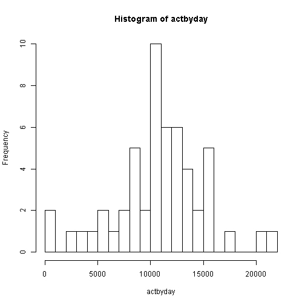
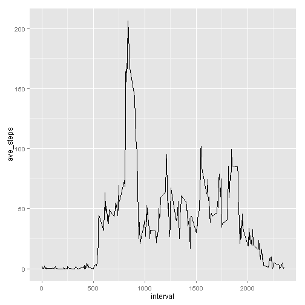
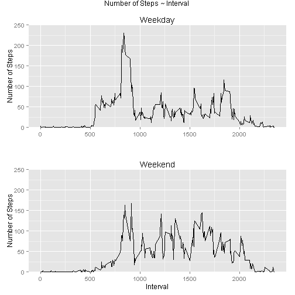

# Reproducible Research: Peer Assessment 1
## Introduction

It is now possible to collect a large amount of data about personal movement using activity monitoring devices such as a Fitbit, Nike Fuelband, or Jawbone Up. These type of devices are part of the "quantified self" movement - a group of enthusiasts who take measurements about themselves regularly to improve their health, to find patterns in their behavior, or because they are tech geeks. But these data remain under-utilized both because the raw data are hard to obtain and there is a lack of statistical methods and software for processing and interpreting the data.

This assignment makes use of data from a personal activity monitoring device. This device collects data at 5 minute intervals through out the day. The data consists of two months of data from an anonymous individual collected during the months of October and November, 2012 and include the number of steps taken in 5 minute intervals each day.

## Loading and preprocessing the data
First, I'll load the data from a zipped csv file into a dataset called act:

```r
suppressMessages(require(ggplot2))
suppressMessages(require(data.table))
suppressMessages(require(gridExtra))

fname <- "./activity.zip"

if (file.exists(fname)) {
    fn <- unzip(fname, list = T)[, 1]
    unzip(fname)
    act <- read.csv(fn)
    file.remove(fn)
}
```

```
## [1] TRUE
```

At this stage, I don't think it necessary to do any processing of the data, and here is a brief overall summary of the activity data I just loaded in:

```r
summary(act)
```

```
##      steps               date          interval   
##  Min.   :  0.0   2012-10-01:  288   Min.   :   0  
##  1st Qu.:  0.0   2012-10-02:  288   1st Qu.: 589  
##  Median :  0.0   2012-10-03:  288   Median :1178  
##  Mean   : 37.4   2012-10-04:  288   Mean   :1178  
##  3rd Qu.: 12.0   2012-10-05:  288   3rd Qu.:1766  
##  Max.   :806.0   2012-10-06:  288   Max.   :2355  
##  NA's   :2304    (Other)   :15840
```


## What is mean total number of steps taken per day?
Here is a histogram and a summary of the total numer of steps per day.

```r
actbyday <- tapply(act$steps, act$date, sum)
hist(actbyday, breaks = 20)
```

 

```r
summary(actbyday)
```

```
##    Min. 1st Qu.  Median    Mean 3rd Qu.    Max.    NA's 
##      41    8840   10800   10800   13300   21200       8
```

The mean and median total number of steps taken per day are as follows, if not considering missing values:

```r
mean(actbyday, na.rm = T)
```

```
## [1] 10766
```

```r
median(actbyday, na.rm = T)
```

```
## [1] 10765
```


## What is the average daily activity pattern?
The following figure depicts a time series plot of the 5-minute interval (x-axis) and the average number of steps taken, averaged across all days (y-axis):

```r
actbyint <- tapply(act$steps, act$interval, mean, na.rm = TRUE)
dt <- data.table(interval = as.integer(names(actbyint)), ave_steps = actbyint)
qplot(x = interval, y = ave_steps, data = dt, geom = "line")
```

 

Note that the following 5-minute interval, on average across all the days in the dataset, contains the maximum number of steps:

```r
dt[ave_steps == max(dt[, ave_steps])]$interval  # interval of max ave_steps
```

```
## [1] 835
```


## Imputing missing values
Now I calculate and report the total number of missing values in the dataset, i.e. total number of rows with NAs. Note that all missing values are in the steps column:

```r
    sum(with(act, is.na(steps)|is.na(date)|is.na(interval))) # total rows with NAs
```

```
## [1] 2304
```

```r
    with(act, c(    sum(is.na(steps)),       # total rows with NA steps
                    sum(is.na(date)),        # no date is missing
                    sum(is.na(interval))    # no interval is missing
                    ))
```

```
## [1] 2304    0    0
```

Now I fill in all of the missing values in the dataset with the mean for each 5-minute interval. A new dataset (actnew) that is equal to the original dataset but with the missing data filled in is created:

```r
actnew <- act
actnew[with(actnew, is.na(steps)), ]$steps <- actbyint
```

Make sure the new dataset has the same mean for each 5-minute interval:

```r
sum(with(actnew, is.na(steps) | is.na(date) | is.na(interval)))  # no missing data now
```

```
## [1] 0
```

```r
newactbyint <- tapply(actnew$steps, actnew$interval, mean, na.rm = F)
setequal(actbyint, newactbyint)  # and averages are equal to old ones
```

```
## [1] TRUE
```


The following is a histogram of the total number of steps taken each day and the mean and median total number of steps taken per day, using the new dataset. 

```r
newactbyday <- tapply(actnew$steps, actnew$date, sum)
hist(newactbyday, breaks = 20)
```

 

```r
mean(newactbyday)
```

```
## [1] 10766
```

```r
median(newactbyday)
```

```
## [1] 10766
```


Compared with those in the first part of the assignment, with the addition of missing data on the estimates of the total daily number of steps, the median value is slightly  shifted up a little bit, but not the mean.

```r
mean(newactbyday) - mean(actbyday, na.rm = T)  # shift of mean
```

```
## [1] 0
```

```r
median(newactbyday) - median(actbyday, na.rm = T)  # shift of median
```

```
## [1] 1.189
```


## Are there differences in activity patterns between weekdays and weekends?
Now I create a new factor variable and add it to the dataset with two levels - "weekday" and "weekend" indicating whether a given date is a weekday or weekend day.

```r
wkd <- as.factor(ifelse(weekdays(as.POSIXlt(actnew$date)) %in% c("Saturday", 
    "Sunday"), "weekend", "weekday"))
actnewwkd <- cbind(actnew, wkd)
```


Now I plot the 5-minute interval (x-axis) and the average number of steps taken, averaged across all weekday days or weekend days (y-axis), as shown below:

```r
dtnew <- with(actnewwkd, tapply(steps, list(interval = interval, day = wkd), 
    mean))
dtnew <- as.data.table(cbind(interval = as.numeric(rownames(dtnew)), dtnew))

plot1 <- qplot(data = dtnew, x = interval, y = weekday, geom = "line") + ggtitle("Weekday") + 
    xlab("") + ylab("Number of Steps") + coord_cartesian(ylim = c(0, 250))
plot2 <- qplot(data = dtnew, x = interval, y = weekend, geom = "line") + ggtitle("Weekend") + 
    xlab("Interval") + ylab("Number of Steps") + coord_cartesian(ylim = c(0, 
    250))
grid.arrange(plot1, plot2, nrow = 2, main = "Number of Steps ~ Interval")
```

 

## Conclusion

The mean total number of steps taken per day of this anonymous person during the period of recording is 10766.The average daily activity mainly concentrated in the range of 5-min intervals between 500-2000, with peak activity at interval 835. There are apparent differences in activity patterns between weekdays and weekends, with increased activity in the interval range of about 1000-1700 on weekends, and decreased activity before 1000 on weekends.


